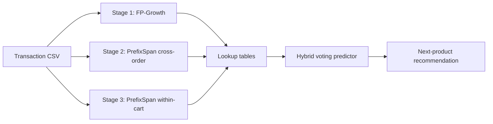

# D-LevS

**D-LevS** (Dual-Level Deterministic Sequence Mining) is a three-stage data-mining pipeline for **sequential next-product prediction** in supermarket / grocery retail. It combines association-rule mining and sequential pattern mining at two complementary levels—**within-cart co-occurrence** and **sequential order behavior**—then fuses them with a deterministic hybrid voting predictor.

The full implementation lives in [`D-levS-pipeline.ipynb`](D-levS-pipeline.ipynb).

---

## Overview

Retail recommendation systems often treat “what goes together in a basket” and “what a customer buys next over time” as separate problems. D-LevS addresses both in one pipeline:

| Stage | Algorithm | Granularity | What it captures |
|-------|-----------|-------------|------------------|
| **Stage 1** | FP-Growth + manual co-occurrence | Product / department | Items frequently bought **together in the same cart** |
| **Stage 2** | PrefixSpan | Product sequence | **Cross-order** sequential patterns (what tends to follow prior purchases) |
| **Stage 3** | PrefixSpan | Product sequence | **Within-cart** sequential patterns (add-to-cart order inside a single order) |

A **3-stage hybrid voting predictor** (`predict_next_hybrid`) queries all three rule sets, aggregates votes, and returns the top recommendation—with lift-based tie-breaking and a popularity fallback when no rules match.



---

## Key results

On the bundled supermarket dataset (~99.5K orders, top-300 products after filtering), the hybrid system outperforms single-stage and popularity baselines:

| Method | Hit Rate @1 | Precision @5 |
|--------|-------------|--------------|
| Random | 0.003 | 0.017 |
| Most Popular (Global) | 0.026 | 0.053 |
| Most Popular (per Dept) | 0.037 | 0.066 |
| Stage 1 (FP-Growth) | 0.034 | 0.068 |
| Stage 1+2 (2-Stage) | 0.034 | 0.068 |
| **3-Stage Hybrid** | **0.052** | **0.089** |

- **+53%** Hit Rate @1 vs. the 2-stage baseline  
- **+100%** Hit Rate @1 vs. global popularity  

---

## Repository contents

```
D-LevS/
├── D-levS-pipeline.ipynb   # End-to-end notebook (setup → mining → evaluation)
├── README.md
└── LICENSE
```

Running the notebook also generates CSV rule exports and PNG visualizations in the working directory (see [Outputs](#outputs)).

---

## Dataset

The notebook expects a flat transaction CSV with one row per line item. Required columns:

| Column | Description |
|--------|-------------|
| `order_id` | Unique order identifier |
| `product_id` | Product identifier |
| `product_name` | Human-readable product name (used in rules) |
| `department` | Store department / category |
| `add_to_cart_order` | Sequence position when the item was added to the cart |
| `user_id` | Customer identifier |
| `order_number` | N-th order for that user |
| `order_dow` | Day of week (0–6) |
| `order_hour_of_day` | Hour of day (0–23) |
| `days_since_prior_order` | Days since previous order |
| `reordered` | Whether the product was reordered (0/1) |

**Default path in the notebook (Kaggle):**

```python
df = pd.read_csv('/kaggle/input/datasets/raiyenzayedrakin/mining-csv/supermarket_flat.csv')
```

For local runs, download the dataset from [Kaggle: mining-csv / supermarket_flat.csv](https://www.kaggle.com/datasets/raiyenzayedrakin/mining-csv) and update the path in **Section 1.1**.

Example shape: `(1,048,575, 11)` rows → **99,574** unique orders.

---

## Requirements

- Python 3.10+ (tested on 3.12)
- Jupyter Notebook or JupyterLab

Install dependencies:

```bash
pip install pandas numpy mlxtend tqdm prefixspan matplotlib seaborn
```

> **Note:** `warnings` is part of the Python standard library. The notebook’s first install cell includes it via `pip`; you can omit that package when installing locally.

---

## Quick start

1. **Clone the repository**

   ```bash
   git clone https://github.com/<your-username>/D-LevS.git
   cd D-LevS
   ```

2. **Install dependencies** (see above).

3. **Place the dataset** and edit the `read_csv` path in the notebook if not running on Kaggle.

4. **Run all cells** in `D-levS-pipeline.ipynb` top to bottom.

   On Kaggle, the notebook metadata expects GPU (T4) and internet access for `pip install prefixspan`; CPU-only execution is sufficient for most cells.

---

## Pipeline walkthrough

### Stage 1 — Association rule mining

1. **Load data** and preview schema (`df.head()`).
2. **Department baskets** — group items by `order_id`.
3. **One-hot encode** baskets with `mlxtend.preprocessing.TransactionEncoder`.
4. **FP-Growth** on departments (`min_support=0.05`) → department association rules (`min_threshold=0.3` confidence).
5. **Scope down** to top 3 departments (`dairy eggs`, `produce`, `snacks`), top **300** products, and filtered orders (~78.9K).
6. **Co-occurrence counting** over product pairs in each basket.
7. **Product rules** — bidirectional A→B and B→A rules with:
   - `min_support = 0.005` (0.5% of orders)
   - `min_confidence = 0.10`
8. **Visualizations** — support vs. confidence bubble chart; department co-occurrence heatmap.

### Stage 2 — Cross-order sequential mining

1. Install **`prefixspan`**.
2. Build a **sequence database** from orders sorted by `add_to_cart_order`.
3. Run **PrefixSpan** (`min_support ≈ 0.5%` of sequences, `maxlen=4`).
4. Derive **sequential rules** (prefix → next item) with support, confidence, and lift.
5. Export rules and plot top-10 rules by lift/confidence.

### Stage 3 — Within-cart sequential mining & hybrid prediction

1. **Order-level sequences** — products in `add_to_cart_order` within each cart (`min_support=0.003`, `minlen=2`, `maxlen=3`).
2. **Lookup tables** — for each antecedent, cache the highest-lift consequent from Stages 1–3.
3. **`predict_next_hybrid(current_product)`** — each stage votes; winner = most agreements; ties broken by lift; fallback = global most popular product.
4. **Evaluation** — cross-stage comparison, baseline benchmarking, top-product performance charts.
5. **Final summary** — rule counts, metrics table, voting logic.

---

## Hyperparameters (defaults)

| Parameter | Stage | Value |
|-----------|-------|-------|
| Department FP-Growth support | 1 | 0.05 |
| Department rule confidence | 1 | ≥ 0.30 |
| Product pair support | 1 | ≥ 0.005 |
| Product rule confidence | 1 | ≥ 0.10 |
| Top departments / products | 1 | 3 / 300 |
| PrefixSpan min support | 2 | 0.5% of sequences |
| PrefixSpan max length | 2 | 4 |
| PrefixSpan min support | 3 | 0.003 |
| PrefixSpan sequence length | 3 | 2–3 |

---

## Outputs

### CSV rule files

| File | Description |
|------|-------------|
| `stage1_department_rules.csv` | Department-level association rules |
| `stage1_product_rules.csv` | Product-level co-occurrence rules |
| `stage2_sequential_rules.csv` | Cross-order sequential rules |
| `stage3_order_rules.csv` | Within-cart sequential rules |

### Visualizations

| File | Description |
|------|-------------|
| `stage1_bubble_chart.png` | Support vs. confidence (Stage 1 rules) |
| `stage1_heatmap.png` | Department co-occurrence heatmap |
| `stage2_sequential_rules_chart.png` | Top sequential rules bar chart |
| `stage3_heatmap_barchart.png` | Stage 3 rule heatmap + lift bar chart |
| `stage3_scatter.png` | Support vs. confidence scatter |
| `stage3_conf_vs_lift.png` | Confidence vs. lift analysis |
| `all_stages_comparison.png` | Cross-stage rule comparison |
| `stages_summary.png` | Rule counts and average lift by stage |
| `stage3_baseline_comparison.png` | Hybrid vs. baseline metrics |
| `stage3_top_products_performance.png` | Top-15 product precision/recall/F1 |

---

## Hybrid voting logic

Given a **current product** (antecedent):

1. **Stage 1** proposes the highest-lift co-occurrence consequent (same cart).
2. **Stage 2** proposes the highest-lift cross-order sequential consequent.
3. **Stage 3** proposes the highest-lift within-cart sequential consequent.
4. Votes are tallied per predicted product; **2+ agreeing stages** indicate high confidence.
5. **Tie-break:** highest lift among tied candidates.
6. **Fallback:** globally most popular product if no stage matches.

Example (from notebook output):

- *Bag of Organic Bananas* → Stage 1 wins with **Organic Hass Avocado** (lift 2.22).
- *Organic Strawberries* → Stages 2 & 3 agree on **Organic Blueberries** (2 votes).
- *Organic Hass Avocado* → Stages 1 & 3 agree on **Organic Lemon** (2 votes).

---

## Using the predictor

After running Stages 1–3 and building lookup tables (Section 3.2), call:

```python
predict_next_hybrid("Organic Hass Avocado", top_k=5, verbose=True)
```

Returns ranked next-product recommendations with stage attribution and lift scores.

---

## License

This project is licensed under the [MIT License](LICENSE).

Copyright (c) 2026 Raiyen Zayed Rakin

---

## Citation

If you use this pipeline in research or production prototypes, please cite the repository:

```bibtex
@software{dlevs2026,
  title  = {D-LevS: Dual-Level Deterministic Sequence Mining for Sequential Next-Product Prediction},
  author = {Raiyen Zayed Rakin},
  year   = {2026},
  url    = {https://github.com/<your-username>/D-LevS}
}
```

Replace `<your-username>` with your GitHub organization or username after publishing the repo.
